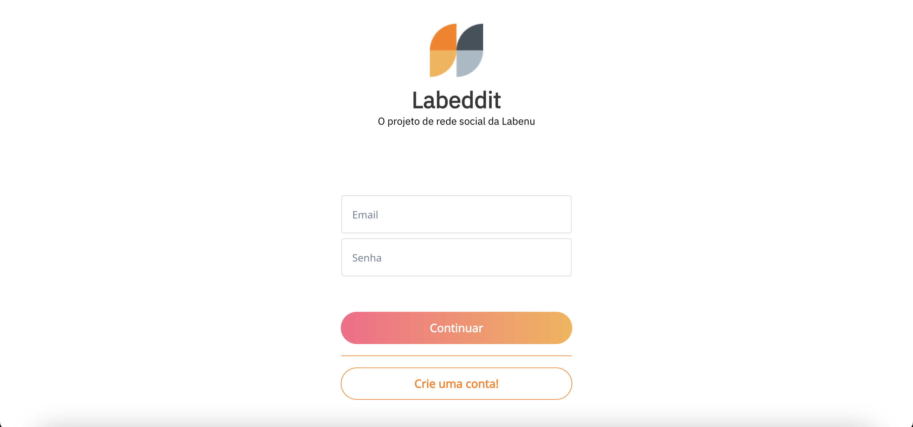
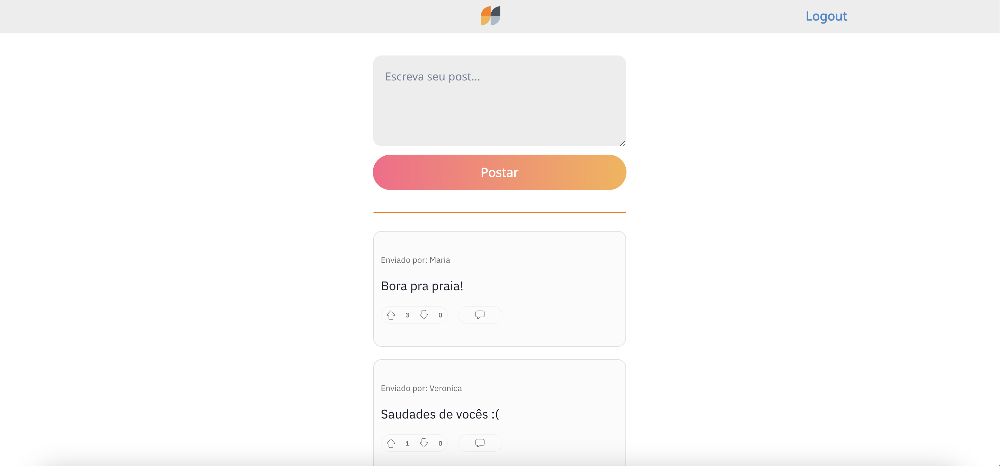

# **Projeto Labeddit**

O Labeddit é uma rede social com o objetivo de promover debates sobre diversos tópicos, por meio de postagens. Quem se cadastrar no aplicativo poderá criar, curtir e comentar publicações dos seus amigos.

## **Backend**
[Repositório](https://github.com/constance03/labeddit-backend)

## **Índice**
- <a href="#funcionalidades-do-projeto">Funcionalidades do projeto</a>
- <a href="#layout">Layout</a>
- <a href="#deploy">Deploy</a>
- <a href="#como-rodar-esse-projeto">Como rodar esse projeto?</a>
- <a href="#tecnologias-utilizadas">Tecnologias utilizadas</a>
- <a href="#pessoas-autoras">Pessoas autoras</a>

## **Funcionalidades do projeto**
- [x] Tela de login
- [x] Tela inicial com todos os posts dos usuários cadastrados
- [x] Tela de comentários
- [x] Opção de criar um novo post
- [x] Opção de comentar posts
- [x] Opção de likes e dislikes em cada post e comentário

## **Layout**



## Deploy
[Deploy no Vercel](https://labeddit-project.vercel.app/)

## **Como rodar esse projeto?**

```
# Clone esse repositório
$ git clone link-repositorio

# Acesse a pasta do projeto no seu terminal
$ cd projeto-labeddit-frontend

# Instale as dependências
$ npm install 

# Execute a aplicação
$ npm start
```

## **Tecnologias utilizadas**
1. [React](https://pt-br.reactjs.org/)
2. [React Router](https://reactrouter.com/)
3. [Styled-components](https://styled-components.com/)
4. [Axios](https://axios-http.com/)

## **Pessoas autoras**


[Linkedin](https://www.linkedin.com/in/mariaconstance/)
